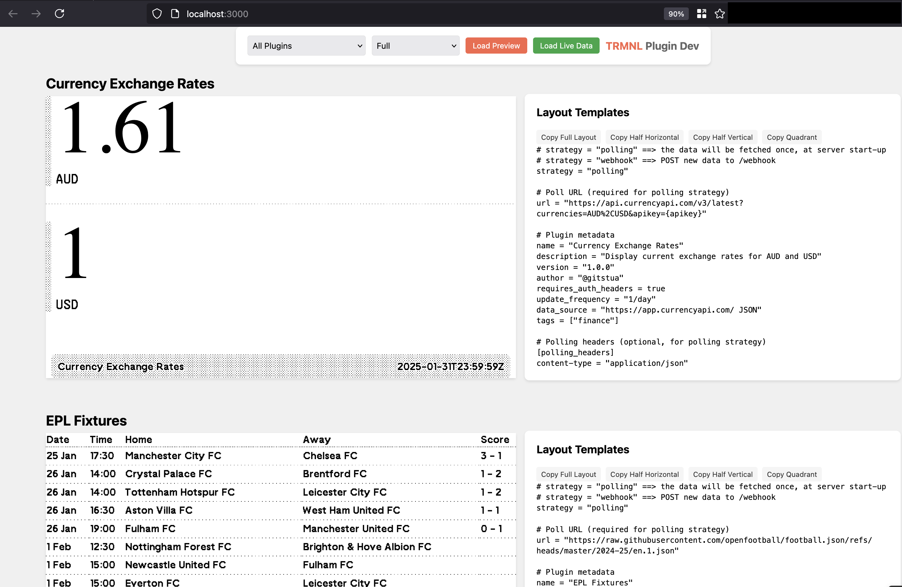
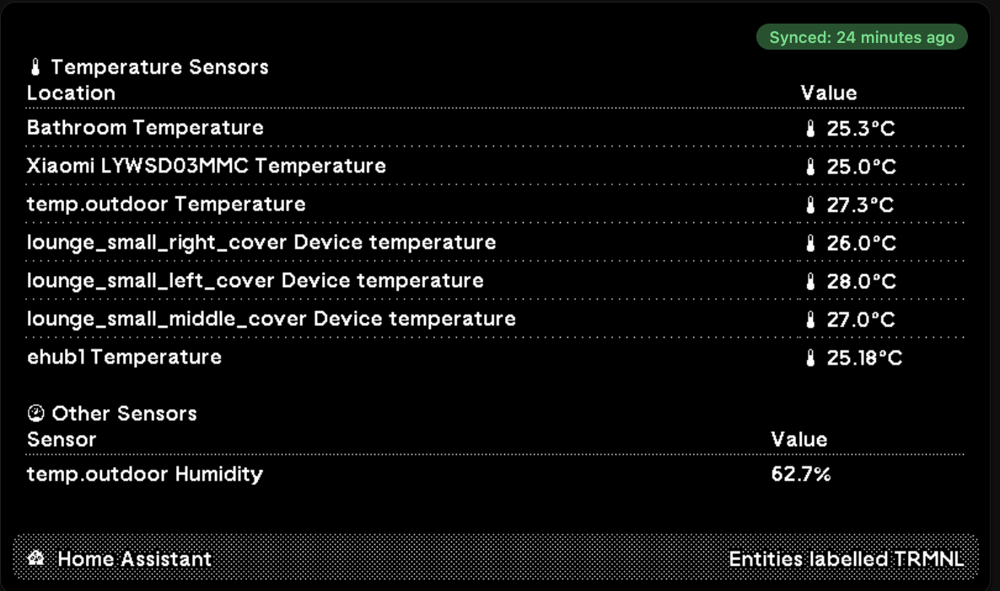
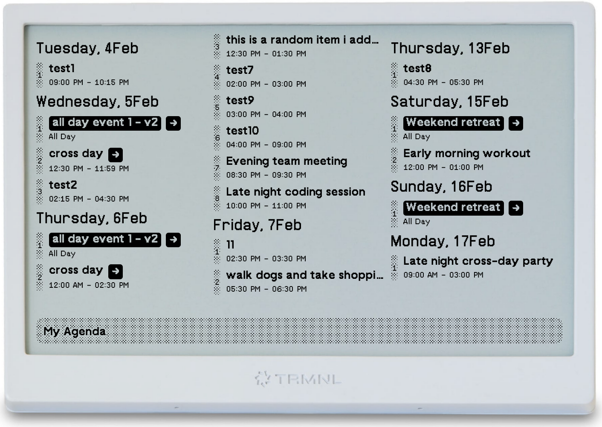
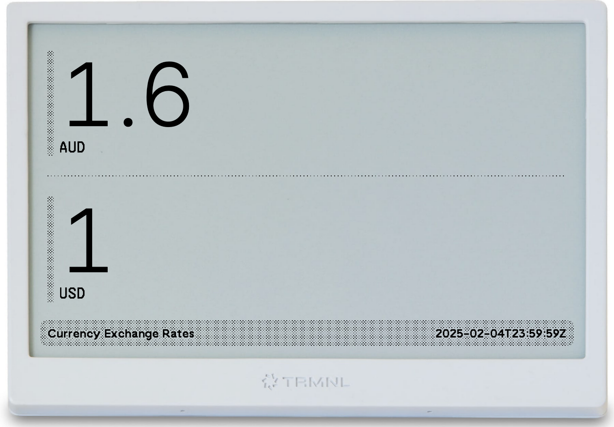
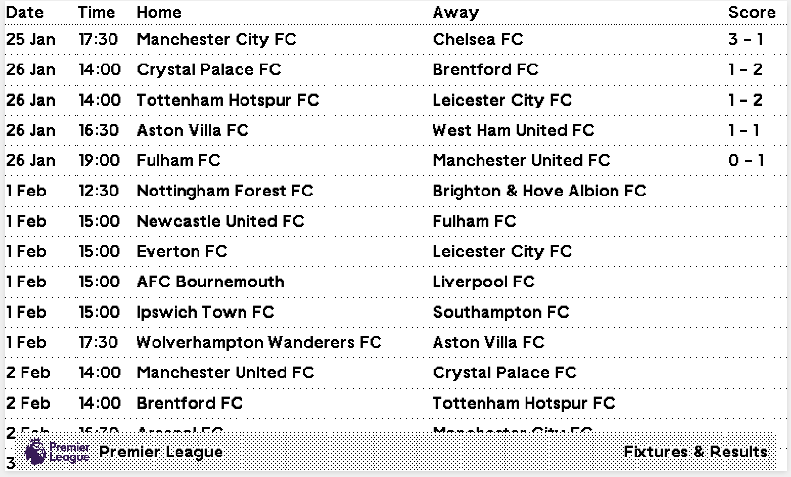
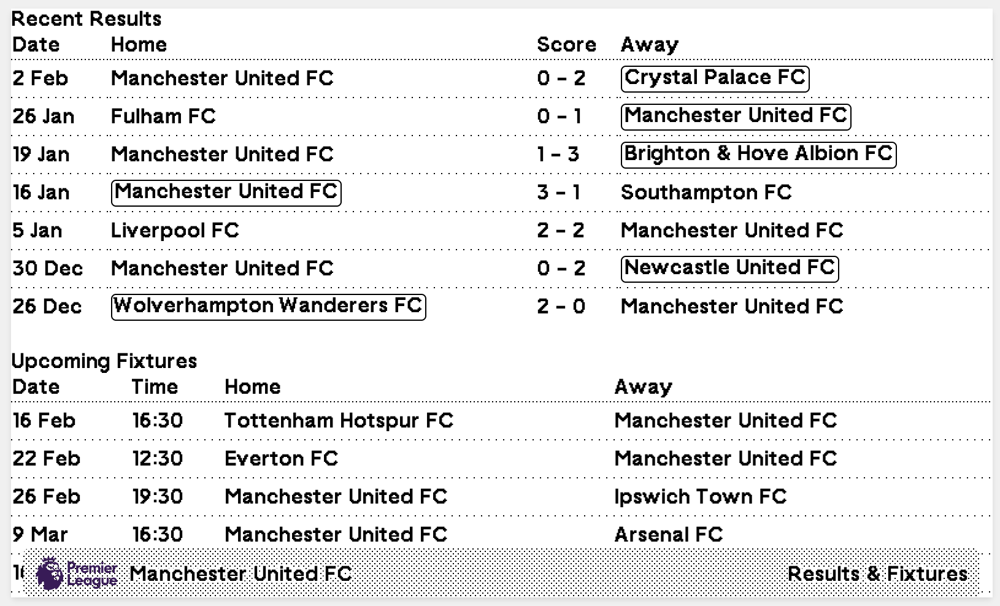
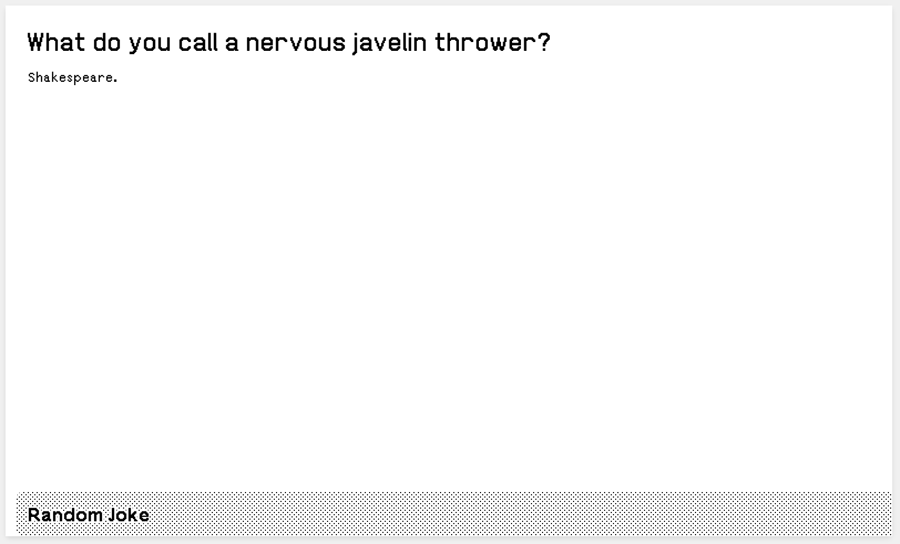

# TRMNL Plugin Tester

A development tool for testing TRMNL plugins.



### Usage

If you want to use this project to test your plugins before you add them to the TRMNL project, then jump to the [Sample plugins in this repo](#sample-plugins-in-this-repo) section.

## Sample plugins in this repo

### Home Assistant TRMNL Plugin


- Display your Home Assistant sensor data in TRMNL
- Shows temperature and other sensors in a clean, organized interface
- **DATA:** Home Assistant API

See [Home Assistant TRMNL Plugin](home-assistant-trmnl/README.md) for full details.

### My Agenda


- Shows upcoming events in an agenda view
- **DATA:** A custom API which converts ICAL to JSON I built and host on Cloudflare Workers.  You can choose to self-host or reach out to me for an API key. See [Source Code for API Service](https://github.com/gitstua/stu-calendar-wrangler-worker#ical-to-json-converter-worker)

### Currency Exchange


- Shows the current exchange rate for a currency pair
- **DATA:** API from [currencyapi.com](https://currencyapi.com/) which gets the exchange rate. Free with rate limit.

### EPL Fixtures


- Shows upcoming English Premier League fixtures
- Displays match dates, teams, and scores in a compact format
- Supports different layouts for various screen sizes
- **DATA:** Connects to a raw file in a GitHub repo. https://github.com/openfootball

### EPL My Team


- Focused view of a specific team's EPL matches (currently only supports Manchester United FC)
- Shows recent results and upcoming fixtures
- Highlights wins with outlined team names
- **DATA:** Connects to a raw file in a GitHub repo. https://github.com/openfootball

### Random Fact


- Displays interesting random facts
- Simple, clean interface for easy reading
- **DATA:** https://uselessfacts.jsph.pl (Free)

### Random Joke


- Shows setup and punchline of random jokes
- Optimized for smaller display formats
- Great for adding humor to your dashboard
- **DATA:** https://official-joke-api.appspot.com/random_joke (Free)


## Alternative
Whilst I started writing this just to build something for myself, I did not notice the awesome project by @schrockwell - his https://github.com/schrockwell/trmnl_preview/ came before this and so please checkout that too as it gives better results for the preview.

You can also use this project to test your plugins before you add them to the TRMNL project using the script `./scripts/serve-plugin.sh`. 

Execute `./scripts/serve-plugin.sh` to run the plugin with the TRMNL Preview Server by @schrockwell. 


## Getting Started

### Prerequisites
- Ensure you have [Node.js](https://nodejs.org/) installed
- Git installed on your machine

### Installation
1. Clone the repository:
   ```bash
   git clone https://github.com/gitstua/trmnl-plugin-dev.git
   cd trmnl-plugin-dev
   ```

2. Install dependencies:
   ```bash
   npm install
   ./scripts/download-cached-cdn-files.sh
   ```

3. Start the development server:
   ```
   There is a convenience script to start the server.
   ```bash
   ./scripts/start-server.sh
   ```

   This will start the server and provide the URL to open preview in your browser.
   
   
