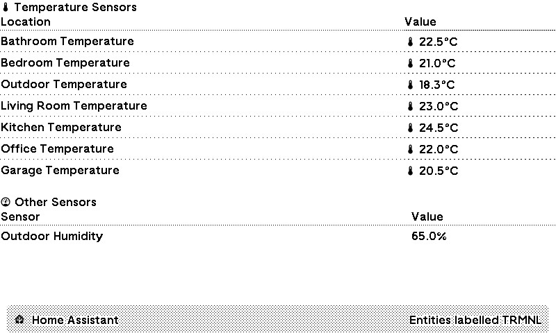
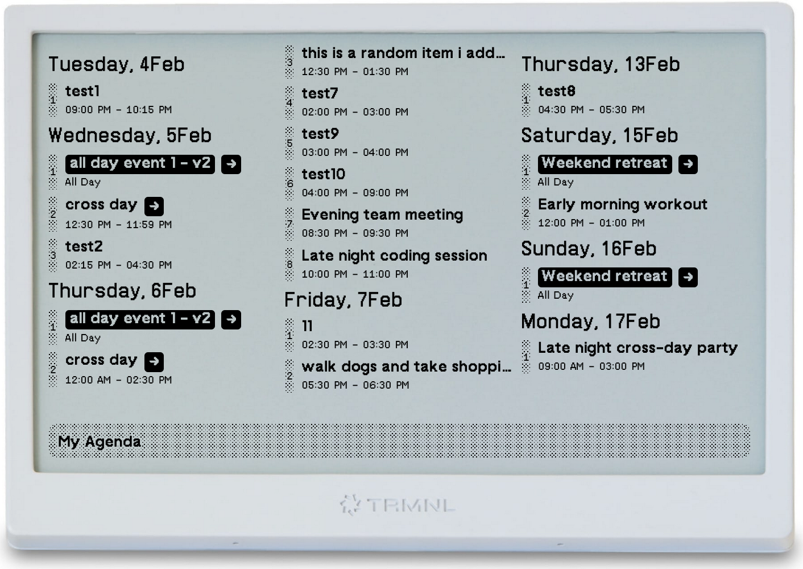
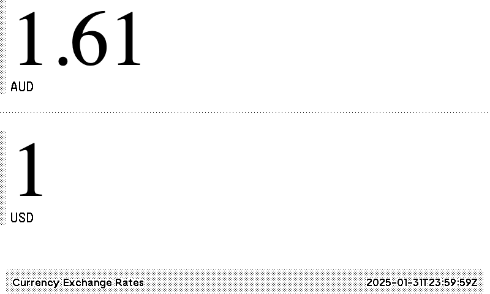
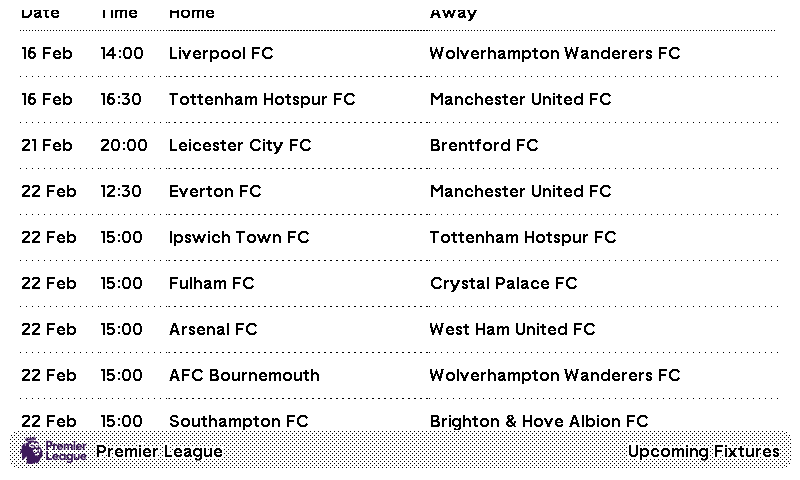
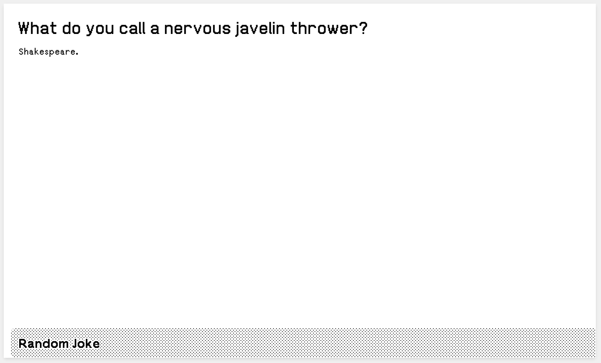
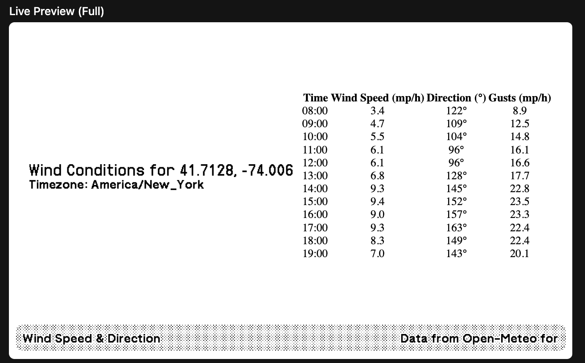
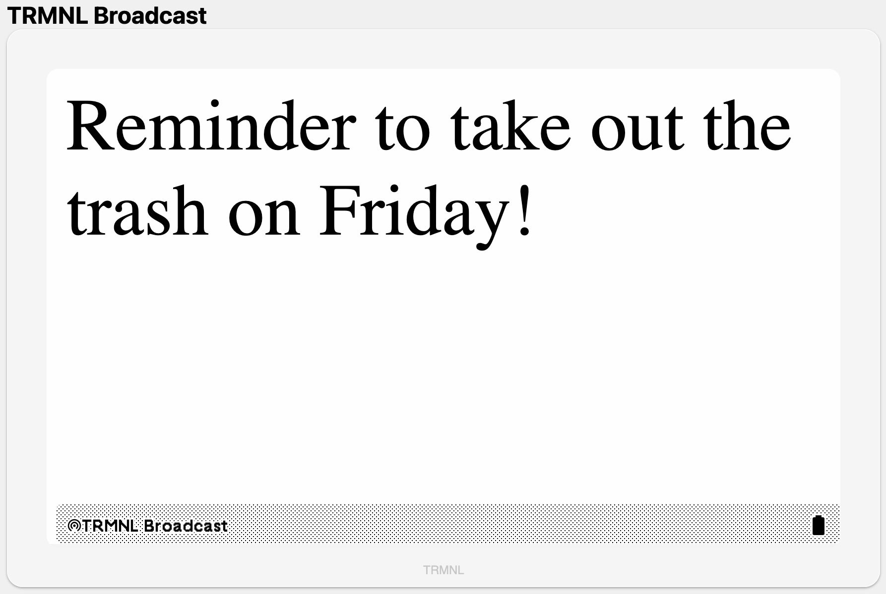
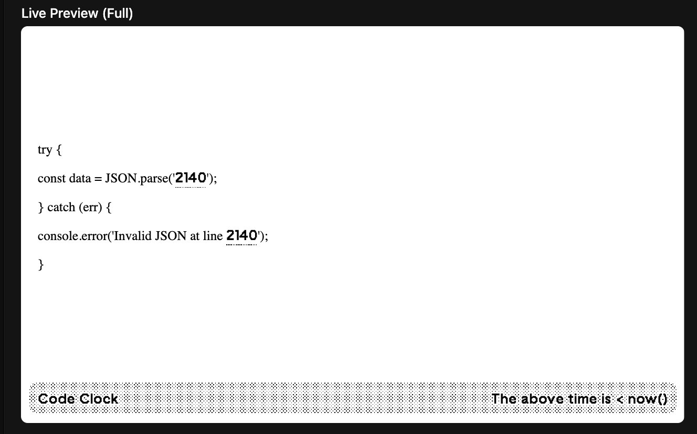

# TRMNL Plugin Tester

A development tool for testing TRMNL plugins.

## Features

- Shows a list of plugins in this repo
- Allows you to preview each plugin with full, half-horizontal, half-vertical layouts and quadrant layouts
- supports working against local `plugin.json` files or calling your API
- allows copying the layouts and any API url to the clipboard for easy pasting into the [useTRMNL.com](https://usetrmnl.com) plugin dashboard


### Usage

If you want to use this project to test your plugins before you add them to the TRMNL project, then jump to the [Getting Started](#getting-started) section.

### Example online
I am deploying the Docker version of this project to [trmnl-plugins.fly.dev](https://trmnl-plugins.fly.dev/) so you can try it out without having to install anything. This version is limited to the plugins in this repo. Any API which needs an API key will not work in the online version so use the Load Preview button to see the plugin in action with sample data.

To develop a plugin, you need to run this locally either by building the Docker image or running the Node.js server.

## Sample plugins in this repo

### Home Assistant TRMNL Plugin


- Display your Home Assistant sensor data in TRMNL
- Shows temperature and other sensors in a clean, organized interface
- **DATA:** Home Assistant API
- **SOURCE:** [_plugins/home-assistant-trmnl](_plugins/home-assistant-trmnl)

See [Home Assistant TRMNL Plugin](home-assistant-trmnl/README.md) for full details.

### NTFY Plugin


- Displays periodic alerts from the [ntfy.sh](https://ntfy.sh/) notification service.
- Optimized for TRMNL devices with periodic updates.
- **DATA:** ntfy.sh API
- **SOURCE:** [_plugins/ntfy](_plugins/ntfy)

### My Agenda


- Shows upcoming events in an agenda view
- **DATA:** A custom API which converts ICAL to JSON I built and host on Cloudflare Workers. You can choose to self-host or reach out to me for an API key. See [Source Code for API Service](https://github.com/gitstua/stu-calendar-wrangler-worker#ical-to-json-converter-worker)
- **SOURCE:** [_plugins/my-agenda](_plugins/my-agenda)

### Currency Exchange


- Shows the current exchange rate for a currency pair
- **DATA:** API from [currencyapi.com](https://currencyapi.com/) which gets the exchange rate. Free with rate limit.
- **SOURCE:** [_plugins/currency-exchange](_plugins/currency-exchange)

### EPL Fixtures
<kbd>

</kbd>
<a href="https://usetrmnl.com/recipes/13395/install" target="_blank">
  
</a>


- Shows upcoming English Premier League fixtures
- Displays match dates, teams, and scores in a compact format
- Supports different layouts for various screen sizes
- **DATA:** Connects to a raw file in a GitHub repo. https://github.com/openfootball
- **SOURCE:** [_plugins/epl-fixtures](_plugins/epl-fixtures)

### EPL My Team


- Focused view of a specific team's EPL matches (currently only supports Manchester United FC)
- Shows recent results and upcoming fixtures
- Highlights wins with outlined team names
- **DATA:** Connects to a raw file in a GitHub repo. https://github.com/openfootball
- **SOURCE:** [_plugins/epl-my-team](_plugins/epl-my-team)

### Random Fact


- Displays interesting random facts
- Simple, clean interface for easy reading
- **DATA:** https://uselessfacts.jsph.pl (Free)
- **SOURCE:** [_plugins/random-fact](_plugins/random-fact)

### Random Joke


- Shows setup and punchline of random jokes
- Optimized for smaller display formats
- Great for adding humor to your dashboard
- **DATA:** https://official-joke-api.appspot.com/random_joke (Free)
- **SOURCE:** [_plugins/random-joke](_plugins/random-joke)

### Wind Speed & Direction


- Displays hourly wind speed, direction, and gusts data
- Shows forecast for configurable location
- Supports different layouts with varying detail levels
- **DATA:** Open-Meteo API (Free, no API key required)
- **SOURCE:** [_plugins/wind-speed-direction](_plugins/wind-speed-direction)

### TRMNL Broadcast


- Display custom messages and announcements on your TRMNL display
- Supports multiple layouts for different screen sizes
- Perfect for office announcements or personal reminders
- **DATA:** Static JSON or custom webhook endpoint which is pushed from Home Assistant, your browser or any other script you want
- **SOURCE:** [_plugins/trmnl-broadcast](_plugins/trmnl-broadcast)

### Code Clock


- Displays the time of image generation embedded in random code snippets
- Shows time in various programming contexts (SQL, JavaScript, Python, etc.)
- Will update periodically with new random code samples and time.
- THIS IS NOT A REALTIME CLOCK - IT IS A CLOCK THAT IS UPDATED WHEN THE IMAGE IS GENERATED on usetrmnl.com hence the text `The above time is < now()`
- **DATA:** Static snippets with dynamic time insertion
- **SOURCE:** [_plugins/code-clock](_plugins/code-clock)

## Alternative
Whilst I started writing this just to build something for myself, I did not notice the awesome project by @schrockwell - his https://github.com/schrockwell/trmnl_preview/ came before this and so please checkout that too as it gives better results for the preview.

You can also use this project to test your plugins before you add them to the TRMNL project using the script `./scripts/serve-plugin.sh`. 

Execute `./scripts/serve-plugin.sh` to run the plugin with the TRMNL Preview Server by @schrockwell. 

## Getting Started

### Prerequisites
- Ensure you have [Node.js](https://nodejs.org/) installed
- Git installed on your machine

### Installation
1. Clone the repository:
```bash
git clone https://github.com/gitstua/trmnl-plugin-dev.git
cd trmnl-plugin-dev
```

2. Start the development server:
```bash
./scripts/run.sh
```

This will start the server and provide the URL to open preview in your browser.

## Docker Support

You can run the TRMNL Plugin Tester using Docker:

### Using Docker Hub Image

To build and run the image, use the following command:
```bash
./scripts/run-docker.sh
```

I have not pushed the image to Docker Hub yet, so you need to build it locally.


# Changelog

## Version 0.4.0

### Changes
- Added support for new plugin configuration options
- Improved error handling and logging
- Enhanced preview layout system
- Added new device simulation features
- Updated dependencies to latest versions
- Fixed various bugs and improved stability

### New Features in 0.4.0
1. **Enhanced Layout System**: Added support for new layout types and improved existing ones
2. **Better Error Handling**: More detailed error messages and improved error recovery
3. **Device Simulation**: Added new device simulation features for more accurate testing
4. **Performance Improvements**: Optimized resource usage and improved response times

### Breaking Changes
- Removed deprecated API endpoints
- Updated plugin configuration format

### Migration Guide
To upgrade from 0.3.0 to 0.4.0:
1. Update your dependencies: `npm install`
2. Review your plugin configurations for any breaking changes
3. Update any custom scripts to use the new API endpoints
4. Test your plugins thoroughly with the new version

## Credits / Acknowledgements

This project would not have been possible without 
- The invaluable work the [TRMNL](https://usetrmnl.com/) project—especially its [Framwork / Design System](https://usetrmnl.com/framework/) and [firmware](https://github.com/usetrmnl/firmware). 
- Special thanks to [@schrockwell](https://github.com/schrockwell) for his work on the [TRMNL Preview](https://github.com/schrockwell/trmnl_preview)
- [LiquidJS](https://liquidjs.com) for the templating engine
- [ImageMagick](https://imagemagick.org/) for the image conversion
- Many more open source projects and libraries that make this project possible
