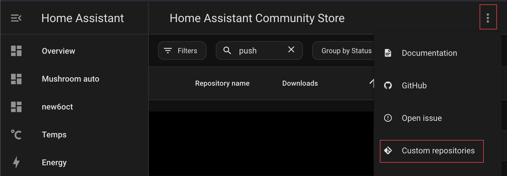

# Home Assistant TRMNL Plugin

Display your Home Assistant sensor data in TRMNL. This plugin shows temperature and other sensors in a clean, organized interface.

- Uses Home Assistant [shell_command](https://www.home-assistant.io/integrations/shell_command/) to send data to TRMNL.
- Uses a [Home Assistant Label](https://www.home-assistant.io/docs/organizing/labels/) `TRMNL` to identify the entities to send to TRMNL via the webhook.

## Prerequisites
- A Home Assistant instance (Only tested with version 2025.1)
- HACS installed
- A TRMNL account
- A TRMNL device

## Private Plugin Setup Instructions

1. Download the ZIP file from [github.com/gitstua/trmnl-plugin-dev/tree/main/_plugins/home-assistant-trmnl/releases](https://github.com/gitstua/trmnl-plugin-dev/tree/main/_plugins/home-assistant-trmnl/releases)
2. Navigate to [usetrmnl.com/plugin_settings?keyname=private_plugin](https://usetrmnl.com/plugin_settings?keyname=private_plugin)
3. Select IMPORT and specify the ZIP file
4. Select SAVE
5. Note the WebHook URL

## Home Assistant Setup Instructions (with HACS)
The data is sent from Home Assistant to TRMNL via a webhook.
1. In Home Assistant, go to  HACS > ... > Custom repositories

2. Add the custom repository `https://github.com/gitstua/trmnl-sensor-push`
3. Select DOWNLOAD
4. Restart Home Assistant
5. In Home Assistant, go to Settings > Devices & Services and select ADD INTEGRATION
6. Select **TRMNL Entity Push** and specify your WebHook URL from the TRMNL private plugin

## Label Your Entities in Home Assistant

1. In Home Assistant, go to Settings > Devices & Services
2. Select "Entities"
3. Click the checkbox icon next to filters to enable selection mode

4. Select the entities you want to display in TRMNL
5. Click "Add Label" in the top right
6. Create a new label called "TRMNL"

You may need to Restart Home Assistant and Force refresh in the plugin page to see the new entities.

## Troubleshooting
If you don't see the data in TRMNL, try the following:

1. Check that the automation is running by going to Automation > Edit Automation
2. Check that the webhook URL is correct
3. Check that the entities are labeled with "TRMNL"
4. Go to the Home Assistant logs and check for any errors
5. Restart Home Assistant with Settings > System > Restart 