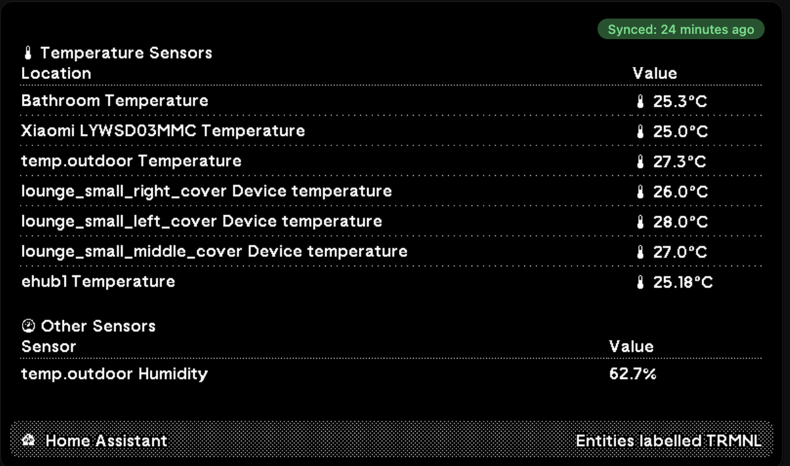
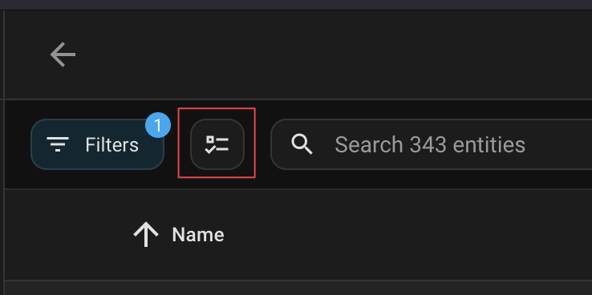
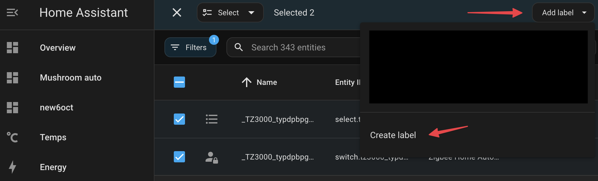
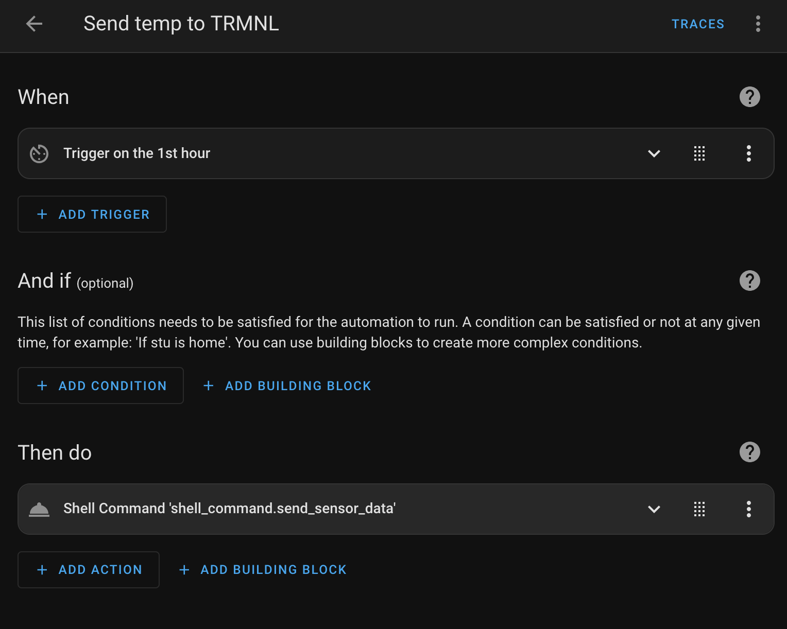

# Home Assistant TRMNL Plugin

Display your Home Assistant sensor data in TRMNL. This plugin shows temperature and other sensors in a clean, organized interface.

- Uses Home Assistant [shell_command](https://www.home-assistant.io/integrations/shell_command/) to send data to TRMNL.
- Uses a [Home Assistant Label](https://www.home-assistant.io/docs/organizing/labels/) `TRMNL` to identify the entities to send to TRMNL via the webhook.



## Setup Instructions

### 1. Create Private Plugin in TRMNL

1. Go to [https://usetrmnl.com](https://usetrmnl.com)
2. Navigate to Plugins > Create Plugin
3. Select "Webhook" as the Strategy
4. Save the plugin and copy the webhook URL for the next step (webhook URL will be similar to https://usetrmnl.com/api/custom_plugins/AAAA-d000-4000-8000-000000000000)

### 2. Configure Home Assistant integration

Add the following to your `configuration.yaml`: (replace YOUR_WEBHOOK_URL with the webhook URL from the previous step)
```
shell_command:
send_sensor_data: >-
curl "YOUR_WEBHOOK_URL" \
-H "Content-Type: application/json" \
-d '{"merge_variables":{"entities":[{"id":"{{ entity_id }}","name":"{{ states[entity_id].name if states[entity_id].name else 'unknown' }}","state":"{{ states[entity_id].state }}","area":"{{ states[entity_id].attributes.area if 'area' in states[entity_id].attributes else 'unknown' }}","icon":"{{ states[entity_id].attributes.icon if 'icon' in states[entity_id].attributes else 'mdi:help-circle' }}","state_class":"{{ states[entity_id].attributes.state_class if 'state_class' in states[entity_id].attributes else 'unknown' }}","unit_of_measurement":"{{ states[entity_id].attributes.unit_of_measurement if 'unit_of_measurement' in states[entity_id].attributes else 'unknown' }}","device_class":"{{ states[entity_id].attributes.device_class if 'device_class' in states[entity_id].attributes else 'unknown' }}","friendly_name":"{{ states[entity_id].attributes.friendly_name if 'friendly_name' in states[entity_id].attributes else 'unknown' }}"},]}}' \
-X POST
```

### 3. Restart Home Assistant
Settings > System > Restart 

### 4. Label Your Entities in Home Assistant

1. In Home Assistant, go to Settings > Devices & Services
2. Select "Entities"
3. Click the checkbox icon next to filters to enable selection mode


4. Select the entities you want to display in TRMNL
5. Click "Add Label" in the top right
6. Create a new label called "TRMNL"


7. Apply the label to your selected entities

### 5. Create the Automation

Add this automation to send data hourly:



```
automation:
- alias: "Send Sensor Data to TRMNL"
  trigger:
    - platform: time
      at: "00:00:00"
  action:
    - service: shell_command.send_sensor_data
```

### 6. Edit markup for the TRMNL plugin with the following:
- [full.liquid](./views/full.liquid)
- [half-horizontal.liquid](./views/half-horizontal.liquid)
- [half-vertical.liquid](./views/half-vertical.liquid)
- [quadrant.liquid](./views/quadrant.liquid)

## Troubleshooting

If you don't see the data in TRMNL, try the following:

1. Check that the automation is running by going to Automation > Edit Automation
2. Check that the webhook URL is correct
3. Check that the entities are labeled with "TRMNL"
4. Go to the Home Assistant logs and check for any errors
5. Restart Home Assistant with Settings > System > Restart 