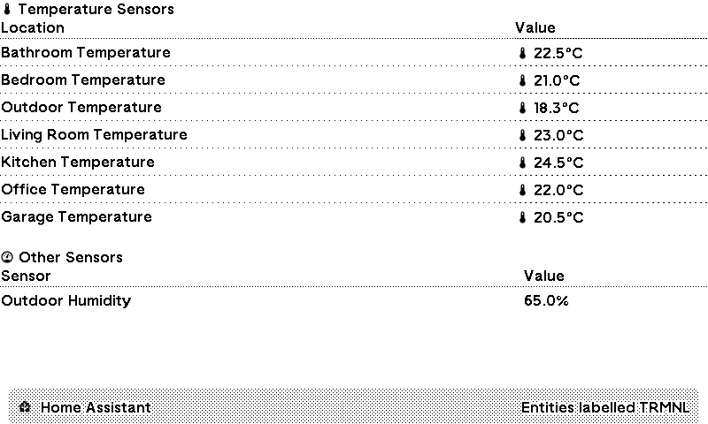

# Home Assistant TRMNL Plugin

Display your Home Assistant sensor data in TRMNL. This plugin shows temperature and other sensors in a clean, organized interface.

- Uses Home Assistant [shell_command](https://www.home-assistant.io/integrations/shell_command/) to send data to TRMNL.
- Uses a [Home Assistant Label](https://www.home-assistant.io/docs/organizing/labels/) `TRMNL` to identify the entities to send to TRMNL via the webhook.

The docs have moved to [here](../_plugins/home-assistant-trmnl/README.md)